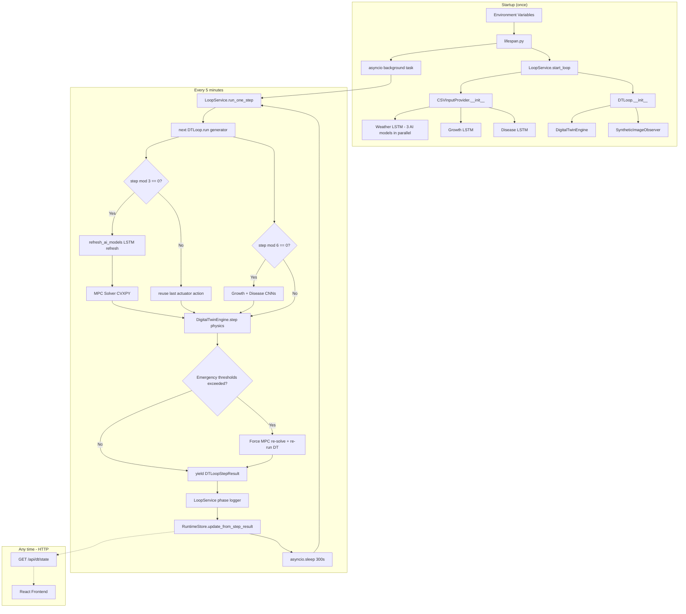

# AgriTwin-GH: DT Loop Streaming — Complete Guide

> **Who is this for?**  
> Written for someone with zero prior knowledge of digital twins, MPC, or this codebase.
> Every section explains the *why* before the *how*. By the end you will know exactly
> what each file does, how data flows through the system, what every log line means,
> and where to make changes to see instant results.

---

## Table of Contents

1. [What is the "DT Loop"? (Plain English)](#1-what-is-the-dt-loop-plain-english)
2. [The Full Picture — One Step at a Time](#2-the-full-picture--one-step-at-a-time)
3. [System Architecture Diagram](#3-system-architecture-diagram)
4. [Every File Involved](#4-every-file-involved)
5. [Step-by-Step Data Flow](#5-step-by-step-data-flow)  
   5.1 [Startup sequence](#51-startup-sequence)  
   5.2 [Per-step execution (every 5 minutes)](#52-per-step-execution-every-5-minutes)  
   5.3 [MPC cadence (every 15 minutes)](#53-mpc-cadence-every-15-minutes)  
   5.4 [Image classification cadence (every 30 minutes)](#54-image-classification-cadence-every-30-minutes)  
   5.5 [AI model refresh (every MPC solve)](#55-ai-model-refresh-every-mpc-solve)  
   5.6 [Growth stage auto-advance](#56-growth-stage-auto-advance)  
6. [Reading the Log File](#6-reading-the-log-file)  
   6.1 [Log file location](#61-log-file-location)  
   6.2 [Anatomy of each log line](#62-anatomy-of-each-log-line)  
   6.3 [Full annotated example](#63-full-annotated-example)  
7. [Cadence Reference — Why Things Are Skipped](#7-cadence-reference--why-things-are-skipped)
8. [AI Models Involved](#8-ai-models-involved)
9. [Growth Stage Timeline](#9-growth-stage-timeline)
10. [Environment Variables — All Knobs](#10-environment-variables--all-knobs)
11. [Where to Make Quick Changes](#11-where-to-make-quick-changes)
12. [Running the System](#12-running-the-system)
13. [Quick Difference Tests](#13-quick-difference-tests)
14. [FAQ from Previous Questions](#14-faq-from-previous-questions)
15. [Troubleshooting](#15-troubleshooting)

---

## 1. What is the "DT Loop"? (Plain English)

Imagine a greenhouse growing tomatoes. Inside it there are sensors measuring:

- **Temperature** (°C) — is the air too hot or too cold?
- **Humidity** (% RH) — is air too dry or too moist (disease risk rises)?
- **CO₂** (ppm) — photosynthesis fuel; do plants have enough?
- **Soil moisture** (%) — are roots getting water?
- **Light intensity** (lux) — are plants getting enough light to grow?

These sensors report their readings every **5 minutes**. But we cannot react to
every single reading in real time — by the time humidity spikes, disease may
already be spreading. We need to *predict ahead* and act *proactively*.

The **Digital Twin (DT) loop** does exactly that. It is a computer simulation
that:

1. **Reads** the current greenhouse state (from CSV files in development, from
   sensors in production)
2. **Predicts** how the environment will change over the next hour using a
   physics model
3. **Runs an optimisation solver (MPC)** every 15 minutes to calculate the
   best actuator commands (fan, heater, fogger, LED, irrigation, CO₂ valve)
4. **Simulates** the result of those commands on greenhouse physics
5. **Feeds** the new predicted state back as the input for the next step

This **closed loop** — where each output becomes the next input — is why it is
called a *feedback control loop*. It runs from **seedling on Day 1 all the way
to ripe tomatoes on Day 89**, automatically advancing through each growth stage.

---

## 2. The Full Picture — One Step at a Time

Each 5-minute "step" of the loop does this, in order:

```
INPUT:  Read greenhouse state + weather
   ↓
AI:     Run growth-stage LSTM (where is the plant in its life cycle?)
   ↓
AI:     Run disease-progression LSTM (is any disease spreading?)
   ↓
AI:     [Every 30 min] Run growth-stage CNN on a plant image
AI:     [Every 30 min] Run disease CNN on a leaf image
   ↓
AI:     [Every step] Get 24h weather forecast
   ↓
MPC:    [Every 15 min] Run optimisation solver → produce actuator commands
   ↓
DT:     Run physics engine → compute next greenhouse state
   ↓
DT:     Log Δstate, setpoint errors, disease flags, effect attribution
   ↓
STORE:  Write new state to RuntimeStore (for the API / frontend)
   ↓
WAIT:   Sleep 5 minutes (real time)
   ↓
INPUT:  Next step reads THIS step's output as input
```

---

## 3. System Architecture Diagram



---

## 4. Every File Involved

### Overview table

| File | Location | Role | Changes to… |
|------|----------|------|-------------|
| `lifespan.py` | `src/agritwin_gh/core/` | FastAPI startup/shutdown hook; reads env vars; creates LoopService; launches background task | Defaults for stage, steps, interval |
| `loop_service.py` | `src/agritwin_gh/services/` | Owns the DT loop lifecycle; bridges generator → RuntimeStore; writes log file | Cadence defaults, log format, resource accounting |
| `dt_loop.py` | `src/agritwin_gh/mpc/` | Multi-rate closed-loop engine; generator that yields one step at a time | MPC/image cadence, event thresholds, stage auto-advance |
| `dt_input_provider.py` | `src/agritwin_gh/mpc/` | Abstracts where inputs come from (CSV, DB, synthetic); runs all AI models at startup | CSV paths, AI model init, LSTM refresh |
| `dt_engine.py` | `src/agritwin_gh/mpc/` | Physics simulation (ARX model); computes next state given actuator commands | ARX coefficients, effect attribution |
| `dt_state.py` | `src/agritwin_gh/mpc/` | Data classes: `DTStepInput`, `DTStepOutput`, `DTDiagnostics`, `DTSnapshot` | Fields passed between engine and loop |
| `dt_runtime_prep.py` | `src/agritwin_gh/mpc/` | Builds initial state, weather sequence, `FusedState`, MPC solver instance | Initial conditions, weather synthetic model |
| `dt_image_observer.py` | `src/agritwin_gh/mpc/` | Runs growth-stage CNN + disease CNN; picks random image from dataset folder | CNN model path, image folder selection |
| `realtime_core.py` | `src/agritwin_gh/mpc/` | Stage duration constants; `STAGE_DURATION_HOURS`; `estimate_energy()` | Stage lengths (days) |
| `constants.py` | `src/agritwin_gh/mpc/` | Single source of truth: `GROWTH_STAGES`, disease names, physics constants | Canonical names |
| `runtime_store.py` | `src/agritwin_gh/core/` | In-memory state store; thread-safe bridge between background loop and HTTP handlers | Snapshot fields |
| `mpc_solver.py` | `src/agritwin_gh/mpc/` | CVXPY optimisation solver; returns optimal actuator trajectory | Cost weights, constraints |
| `cost_function.py` | `src/agritwin_gh/mpc/` | MPC objective — setpoint tracking + energy + disease penalties | Penalty weights |
| `disturbance.py` | `src/agritwin_gh/mpc/` | Weather forecast AI model (`WeatherDisturbanceForecast`) | Forecast horizon |
| `main.py` | project root | Entry point; `python main.py` starts uvicorn | Port, host |

---

### Detailed file descriptions

#### `lifespan.py` — The Traffic Controller

**What it does:** This file runs once when you start `python main.py`. It reads
all environment variables (like what growth stage to start from, how many steps
to run), creates a `LoopService`, runs the very first DT step so the API has
real data immediately, and then starts the background task that runs every 5
minutes forever.

**Key functions:**

| Function / Symbol | Purpose |
|---|---|
| `lifespan(app)` | async context manager — runs `startup`, then yields, then `shutdown` |
| `_env_bool(key, default)` | reads `"1"` / `"0"` env var with a default |
| `_env_int(key, default)` | reads integer env var safely |
| `_env_float(key, default)` | reads float env var safely |
| `_continuous` | `True` = background task starts; `False` = only step 0 runs |

---

#### `loop_service.py` — The Conductor

**What it does:** Owns the loop's entire lifecycle. Starts it, runs one step at
a time, and writes everything to the store and the log file. Every log line you
see in `logs/dt_loop_*.log` is written from this file.

**Key methods:**

| Method | Purpose |
|---|---|
| `start_loop(growth_stage, total_steps, auto_advance_stage)` | Creates `DTLoop`, creates generator, sets loop_start timestamp |
| `run_one_step()` | Calls `next(self._gen)`, enriches result, logs 10+ lines per step, updates store |
| `run_background_loop(interval_seconds)` | `async` — calls `run_one_step()` every `interval_seconds` (default 300) |
| `stop_loop()` | Sets `_running = False`; loop exits after current step |
| `_phase(step, tag, msg)` | Writes one tagged line to the rotating log file |

**Log file setup (inside `loop_service.py`):**

```python
# Location: logs/dt_loop_YYYYMMDD.log
# Format:   2026-04-05 04:47:18  STEP 0000 | TAG   | message
# Rotation: 5 MB cap, 3 backup files (dt_loop_YYYYMMDD.log.1, .2, .3)
```

---

#### `dt_loop.py` — The Engine Room

**What it does:** The actual closed-loop generator. When you call
`loop.run(n_steps=25632)` it returns a Python generator. Each time you call
`next()` on it, it advances by one 5-minute step and yields a
`DTLoopStepResult`. It never sleeps — wall-clock delay is handled by
`loop_service.py`.

**Key constants (at the top of the file):**

```python
MPC_CADENCE_STEPS:   int = 3   # MPC runs every 3 steps = every 15 min
IMAGE_CADENCE_STEPS: int = 6   # CNN runs every 6 steps = every 30 min
```

**Key class: `DTLoopStepResult`** — everything that happened in one step:

```python
@dataclass
class DTLoopStepResult:
    step_index:          int          # which step (0-based)
    timestamp:           datetime     # logical time of this step
    current_state:       GreenhouseState  # state BEFORE this step
    weather_used:        WeatherState     # outdoor conditions this step
    next_state:          GreenhouseState  # state AFTER physics
    diagnostics:         DTDiagnostics   # Δstate, effects, energy, etc.
    action_applied:      ActuatorState   # actuator commands used
    mpc_ran_this_step:   bool
    mpc_forced:          bool            # True = emergency re-solve
    mpc_solution:        MPCSolution     # full trajectory (if MPC ran)
    image_refresh_this_step: bool
    image_observation:   ImageObservation | None
    cadence_info:        dict            # growth/disease model outputs
```

**Event-triggered emergency MPC re-solve:**

```python
# If ANY of these are true after the DT step, MPC runs immediately
# regardless of the 15-min cadence, then re-runs the DT step with
# the corrected actuators:
if indoor_humidity > 85.0:    → force MPC
if disease_risk    > 0.55:    → force MPC
if indoor_temp < 12.0 or > 38.0: → force MPC
```

---

#### `dt_input_provider.py` — The Data Source

**What it does:** Abstracts where inputs come from. In development/demo mode
it uses `CSVInputProvider`, which reads historical 2025 data from two CSV files.
It also runs all three AI startup models concurrently (in thread pool workers)
so startup is fast.

**`CSVInputProvider` — what it loads:**

| Data | Source file | How used |
|------|-------------|---------|
| Initial greenhouse state | `data/processed/Greenhouse Indoor Conditions/dindigul_greenhouse_indoor_2025.csv` | Row matching current hour |
| Weather sequence | `data/external/Weather Data/dindigul_weather_2025.csv` | Daily rows padded to fill all steps |
| Growth LSTM prediction | `models/artifacts/growth_stage_progression_*` | Runs once at startup in thread pool |
| Disease LSTM prediction | `models/artifacts/disease_progression_*` | Runs once at startup in thread pool |
| Weather forecast | `models/artifacts/weather_forecast_*` | Runs once at startup in thread pool |

**`refresh_ai_models(hourly_states, stage, ts)` — called every MPC cycle (step > 0):**

Re-runs the growth and disease LSTMs with the last 24 hours of actual
simulated states from `self._state_history`. This is how predictions become
progressively more accurate as the simulation accumulates real history.

> **Why doesn't the forecast change much early on?**  
> At step 3 (first MPC after step 0), the history deque has only 3 entries.
> Subsampled every 12th → 1 entry → LSTM gets a nearly flat 24h window.
> After ~144 steps (12 hours), the window contains genuine variation and
> predictions start to evolve meaningfully.

---

#### `dt_engine.py` — The Physics

**What it does:** Given a current state, weather, and actuator commands,
it computes what the greenhouse will look like in 5 minutes. Uses an
**ARX (AutoRegressive with eXogenous inputs)** model — each variable's next
value is a weighted sum of its current value plus contributions from every
actuator and weather effect.

For example, temperature:

$$T_{t+1} = T_t + \underbrace{\alpha(T_{ext} - T_t)}_{\text{weather exchange}} + \underbrace{\beta \cdot S_{solar}}_{\text{solar heating}} + \underbrace{\gamma \cdot P_{heater}}_{\text{heater}} - \underbrace{\delta \cdot v_{fan}}_{\text{fan cooling}} - \underbrace{\epsilon \cdot v_{vent}}_{\text{vent cooling}}$$

The `DTDiagnostics.effect_attribution` field records each of these
contributions separately so you can see exactly what drove each variable's
change.

---

#### `dt_state.py` — The Message Envelopes

**What it does:** Pure data containers. No logic — just holds values so
files can talk to each other.

| Class | Carries |
|-------|---------|
| `DTStepInput` | Everything the engine needs to compute one step |
| `DTStepOutput` | What the engine produces (next_state + diagnostics + snapshot) |
| `DTDiagnostics` | Δstate, setpoint errors, effect attribution, disease flags, energy/water |
| `DTSnapshot` | Summary statistics (used by RuntimeStore) |

---

#### `runtime_store.py` — The Whiteboard

**What it does:** A thread-safe in-memory store. The background loop writes to
it every 5 minutes. The API reads from it on every HTTP request (< 1 ms, no
computation). This means your React dashboard always gets instant responses
even though MPC takes 50–200 ms.

The store holds seven domain snapshots, updated atomically:

```
ClimateSnapshot   — temperature, humidity, CO₂, soil, light, VPD, leaf, risk
ActuatorSnapshot  — fan, vent, heater, LED, CO₂ valve, fogger, irrigation
WeatherSnapshot   — outdoor temperature, humidity, solar, wind, conditions
DiseaseSnapshot   — overall risk + per-pathogen breakdown
GrowthSnapshot    — current/next stage, hours remaining, confidence
ResourceSnapshot  — total kWh and litres since loop start
MediaSnapshot     — image URLs (presigned MinIO links or local paths)
```

---

## 5. Step-by-Step Data Flow

### 5.1 Startup Sequence

```
python main.py
  └─ uvicorn starts → triggers FastAPI lifespan
       └─ lifespan.py reads env vars:
            AGRITWIN_GROWTH_STAGE     = "seedling"   (default)
            AGRITWIN_TOTAL_STEPS      = 25632         (default = 89 days)
            AGRITWIN_AUTO_ADVANCE_STAGE = True        (default)
            AGRITWIN_BACKGROUND_LOOP  = True          (default)
            AGRITWIN_STEP_INTERVAL_SEC = 300          (default = 5 min)
       └─ LoopService(store=RuntimeStore) created
       └─ LoopService.start_loop() called:
            └─ CSVInputProvider(start_time=now) created:
                 ├─ Thread 1: WeatherDisturbanceForecast → 24h forecast
                 ├─ Thread 2: GrowthProgressionLSTM     → h_to_transition
                 └─ Thread 3: DiseaseProgressionLSTM    → sev_24h per disease
            └─ DTLoop(growth_stage="seedling", n_steps=25632, auto_advance_stage=True)
            └─ self._gen = loop.run(n_steps=25632)   ← generator created, not run yet
       └─ run_one_step() called once → STEP 0000 executes immediately
            (so the API has real data before any HTTP request arrives)
       └─ asyncio.create_task(run_background_loop(interval_seconds=300))
            └─ STEP 0001 will run 300 seconds from now
```

---

### 5.2 Per-step execution (every 5 minutes)

```
LoopService.run_one_step()
  └─ with self._step_lock:             ← prevents concurrent calls
       ├─ result = next(self._gen)     ← DTLoop.run() generator body executes:
       │    ├─ ts = start_time + step * 5min
       │    ├─ weather = self._weather_seq[step]
       │    ├─ [auto-advance stage if hours_in_stage >= stage_duration]
       │    ├─ mpc_due   = (step % 3 == 0)
       │    ├─ image_due = (step % 6 == 0)
       │    ├─ [MPC block — if mpc_due]
       │    ├─ [Image block — if image_due]
       │    ├─ Build DTStepInput (state + action + weather + AI results)
       │    ├─ dt_out = engine.step(dt_input)         ← physics runs
       │    ├─ [Event check — if thresholds exceeded, force MPC + re-run physics]
       │    ├─ yield DTLoopStepResult                 ← control returns to LoopService
       │    └─ state = dt_out.next_state              ← THIS step's output = NEXT step's input
       ├─ Log 10-15 lines to dt_loop_*.log
       ├─ store.update_from_step_result(result)
       └─ store.accumulate_resources(energy_kwh, water_l)
```

> **Key design fact:** `state = dt_out.next_state` at the bottom of the generator loop
> means each step's output IS the next step's input. Step 0 reads from CSV;
> Step 1 onwards reads from the previous step's DT physics output.

---

### 5.3 MPC Cadence (every 15 minutes)

```
Step 0:  mpc_due = (0 % 3 == 0) = True   → MPC RUNS   → new actuator commands
Step 1:  mpc_due = (1 % 3 == 0) = False  → SKIPPED    → step 0's commands reused
Step 2:  mpc_due = (2 % 3 == 0) = False  → SKIPPED    → step 0's commands reused
Step 3:  mpc_due = (3 % 3 == 0) = True   → MPC RUNS   → new actuator commands
...and so on every 3 steps (= 15 minutes)
```

**Why skip MPC on steps 1 and 2?**

The MPC solver (CVXPY) takes 50–200 ms to converge. Running it every 5 minutes
would mean 12 optimisations per hour, but greenhouse conditions don't change
fast enough to justify that. The 15-minute cadence gives the actuators time to
have real effect before re-optimising.

The actuator commands from the last MPC solve are **held** (reused) on
non-MPC steps — the greenhouse keeps running with those commands.

---

### 5.4 Image Classification Cadence (every 30 minutes)

```
Step 0:  image_due = (0 % 6 == 0) = True  → CNN runs (growth-stage + disease)
Step 1–5:                                  → SKIPPED: "image classify — skipped (image_due=False)"
Step 6:  image_due = (6 % 6 == 0) = True  → CNN runs again
```

**Why skip CNNs on most steps?**

Loading a Keras model and running inference on a crop image is expensive
(~200-500 ms). Doing this every 5 minutes when the leaf's appearance changes
over days, not minutes, would waste compute with no meaningful gain.
Every 30 minutes provides sufficient temporal resolution to track visible
disease appearance.

The CNN result from the last image-refresh step is **held** in
`self._last_image_obs` and reused by the DT engine until the next refresh.

---

### 5.5 AI Model Refresh (every MPC solve)

At every MPC step (where `mpc_due = True` and `step > 0`):

```python
_hourly = list(self._state_history)[::12]   # every 12th entry = 1 per hour
self._input_provider.refresh_ai_models(_hourly, stage, ts)
```

This re-runs the growth-progression LSTM and disease-progression LSTM using the
**accumulated history of actual simulated states** rather than the original CSV
conditions from startup.

The `_state_history` is a `collections.deque(maxlen=288)` — it holds the last
288 DT states (= 24 hours of 5-min steps). As the simulation progresses:

| Step range | History available | LSTM input quality |
|---|---|---|
| Steps 0–3 | < 4 entries | Essentially flat; predictions near-static |
| Steps 12–36 | 1–3 hours | Minor variation |
| Steps 144+ | 12+ hours | Rich history; predictions evolve |
| Steps 288+ | Full 24h window | Maximum LSTM accuracy |

---

### 5.6 Growth Stage Auto-Advance

When `auto_advance_stage=True` (default), the loop tracks how many hours the
plant has been in the current stage. When it reaches the stage's duration, the
stage automatically advances to the next one.

```python
# In dt_loop.py, inside the generator loop, every step:
self._hours_in_stage += 5 / 60   # 5 minutes expressed in hours

if self._hours_in_stage >= STAGE_DURATION_HOURS[current_stage]:
    current_stage = next_stage_in_list
    self._hours_in_stage = 0.0
    logger.info("Step %d: growth stage advanced %s → %s")
```

---

## 6. Reading the Log File

### 6.1 Log File Location

```
logs/
└── dt_loop_YYYYMMDD.log     ← today's log (e.g. dt_loop_20260405.log)
    dt_loop_20260405.log.1   ← rotated when file exceeds 5 MB
```

Configure in `loop_service.py` (top of file):
```python
_LOOP_LOG_DIR  = pathlib.Path(__file__).parents[3] / "logs"
maxBytes       = 5 * 1024 * 1024   # 5 MB
backupCount    = 3
```

---

### 6.2 Anatomy of Each Log Line

Every line in the log has this fixed format:

```
YYYY-MM-DD HH:MM:SS  STEP NNNN | TAG   | message
│                   │          │ │        │
│                   │          │ │        └─ human-readable description
│                   │          │ └─ INPUT / AI / MPC / DT
│                   │          └─ zero-padded step number
│                   └─ wall clock time this step RAN (not logical greenhouse time)
└─ date
```

**Tag meanings:**

| Tag | What it covers |
|-----|---------------|
| `INPUT` | State read at the start of this step + weather |
| `AI` | AI model inference (LSTM growth, LSTM disease, CNN, weather forecast) |
| `MPC` | CVXPY optimisation solver output |
| `DT` | Physics engine result (next state, Δstate, diagnostics) |

---

### 6.3 Full Annotated Example

```log
─────────────────────────────────────────────────────────────
STEP 0000 — the very first step of a fresh run
─────────────────────────────────────────────────────────────

2026-04-05 04:47:18  STEP 0000 | INPUT | state in  — T=28.1°C  RH=76.9%  CO₂=400ppm
    soil=56.8%  light=0lux  VPD=0.88kPa  leaf=0.00  risk=0.000  stage=seedling(0)
```
> **Reading this:** Step 0 reads from the CSV file. `light=0lux` means it is
> night-time (the CSV row matches "now"). `stage=seedling(0)` — index 0 in
> the GROWTH_STAGES tuple.

```log
2026-04-05 04:47:18  STEP 0000 | INPUT | weather in — T_ext=28.9°C  RH_ext=75.2%
    solar=222W/m²  wind=18.4km/h  cond=Partially cloudy
```
> **Reading this:** Outdoor conditions for this step from the weather CSV.

```log
2026-04-05 04:47:18  STEP 0000 | AI    | growth-progression LSTM
    in=[T=28.1°C  RH=76.9%  CO₂=400ppm  light=0lux  (24h window)]
    → stage=seedling  next=flowering initiation  h_to_transition=287.7h
      within_24h=False  within_48h=False
```
> **Reading this:** The growth LSTM predicts the plant is in `seedling` stage
> and **287.7 hours** (about 12 days) remain before it transitions to
> `flowering initiation`. `within_24h=False` — the transition will NOT happen
> in the next 24 hours, so MPC doesn't need to urgently prepare for it.

```log
2026-04-05 04:47:18  STEP 0000 | AI    | disease-progression
    in=[T=28.1°C  RH=76.9%  VPD=0.88kPa  leaf=0.00  (24h window)]
    → early_blight=[sev_24h=0.013  present=False  trend=absent]
      late_blight=[sev_24h=0.014  present=False  trend=absent]
      leaf_mold=[sev_24h=0.016  present=False  trend=absent]
      powdery_mildew=[sev_24h=0.069  present=False  trend=absent]
      spider_mites=[sev_24h=0.007  present=False  trend=absent]
```
> **Reading this:** The disease LSTM runs for all 5 pathogens. `sev_24h=0.013`
> means early blight severity predicted 24 hours from now is 1.3%.
> `present=False` means none are currently detected. `trend=absent` means
> the disease is not spreading. plant is healthy.

```log
2026-04-05 04:47:18  STEP 0000 | AI    | growth-stage CNN
    in=[img:data/external/Tomato Growth Stages/Stage1_Seedling/seedling_080.jpg]
    → Stage1_Seedling  (92.5%)
```
> **Reading this:** The CNN looked at a randomly selected seedling image and
> classified it as `Stage1_Seedling` with 92.5% confidence. This only runs
> on step 0, then every 6 steps (every 30 minutes) after that.

```log
2026-04-05 04:47:18  STEP 0000 | AI    | disease CNN
    in=[img:data/external/Tomato Healthy Leaves/e1860bf2-….JPG]
    → tomato_leaf_healthy  (92.7%)
```
> **Reading this:** Leaf disease CNN classified the leaf image as healthy
> (92.7% confidence). In a real deployment this would use a MinIO-stored
> camera image from the actual greenhouse.

```log
2026-04-05 04:47:18  STEP 0000 | AI    | weather-forecast (24h ahead)
    T_ext=28.6°C  RH=75.6%  solar=226W/m²  wind=21.1km/h  conditions=forecast
```
> **Reading this:** The weather AI model (trained ensemble: Chronos + XGBoost +
> LSTM) predicts tomorrow's outdoor conditions. This runs ONCE at startup and
> the same prediction is shown every step (it is a point forecast, not re-run
> every 5 minutes).

```log
2026-04-05 04:47:18  STEP 0000 | MPC   | solve [cadence]
    in=[T=28.1  RH=76.9  CO₂=400  soil=56.8  light=0  VPD=0.88
        leaf=0.00  risk=0.000  stage=0]
    → fan=0.20  vent=0.15  heat=0.00  led=0.20  co2v=0.20
      fog=0.00  irrig=6.60  cost=61.4228  converged=yes
```
> **Reading this:** `[cadence]` means this is a scheduled 15-minute MPC solve
> (not emergency). The solver received 9 state variables and produced 7 actuator
> commands (all 0–1 duty-cycle fractions except `irrig` in litres).
> `cost=61.4228` is the optimisation objective value (lower = better).
> `converged=yes` means CVXPY found an optimal solution (not a fallback).

```log
2026-04-05 04:47:18  STEP 0000 | DT    | physics
    → T=26.6°C  RH=72.3%  CO₂=452ppm  soil=59.8%  light=213lux
      VPD=0.96kPa  leaf=0.39  risk=0.418  stage=seedling(0)
```
> **Reading this:** After applying MPC actuator commands through the physics
> model, the greenhouse state in 5 minutes will be: T dropped 1.5°C (fan +
> vent cooling), RH dropped 4.6%, CO₂ rose (CO₂ valve injecting), soil moisture
> rose (irrigation), light appeared (LED activated).

```log
2026-04-05 04:47:18  STEP 0000 | DT    | Δstate
    → ΔT=-1.563°C  ΔRH=-4.604%  ΔCO₂=+52.2ppm  Δsoil=+2.960%
      Δlight=+213.0lux  ΔVPD=+0.0833kPa  Δleaf=+0.3944
      energy=0.04029kWh  water=6.600L  compute=0.3ms
```
> **Reading this:** Change from current → next state. `energy=0.04029kWh` is
> the electricity used this step. `water=6.600L` is the irrigation applied.
> `compute=0.3ms` is how long the physics engine took (very fast).

```log
2026-04-05 04:47:18  STEP 0000 | DT    | setpt_err
    → indoor_temp=+3.560  indoor_humidity=-2.710  soil_moisture=-10.240
      co2=-147.800  light_intensity=-37.000  vpd=+0.363
```
> **Reading this:** How far each variable is from its **setpoint** (target).
> `indoor_temp=+3.560` → temperature is 3.56°C above the target (too warm
> despite cooling). `co2=-147.800` → CO₂ is 147.8 ppm below target (plant
> needs more; CO₂ valve is working but hasn't closed the gap yet).

```log
2026-04-05 04:47:18  STEP 0000 | DT    | disease_env → all_clear  (risk_post=0.418)
```
> **Reading this:** None of the disease-environment threshold flags were
> triggered this step. `risk_post=0.418` is the disease risk score
> **after** physics ran. If risk were > 0.55, you would see flag names here
> instead of `all_clear`, AND MPC would be forced to re-solve immediately.

```log
2026-04-05 04:47:18  STEP 0000 | DT    | effects[T]
    → natural_decay=-2.2499  weather_exchange=+0.0621  solar_heating=+1.1080
      heater=+0.0000  fan_cooling=-0.3000  vent_cooling=-0.1800
```
> **Reading this:** Effect attribution for **temperature**. Every driver is listed
> with its signed contribution (in °C) to this step's ΔT=-1.563°C.
> `natural_decay=-2.2499` — the biggest driver: the greenhouse naturally loses
> heat to outdoors. `solar_heating=+1.1080` — incoming solar through glazing.
> `fan_cooling=-0.3000` and `vent_cooling=-0.1800` — actuator effects.
> Sum ≈ -2.2499 + 0.0621 + 1.1080 + 0 - 0.3000 - 0.1800 ≈ -1.56 ✓

```log
2026-04-05 04:47:18  STEP 0000 | DT    | effects[RH]
    → natural_decay=-3.8447  weather_exchange=-0.0847  fogger=+0.0000
      fan_drying=-0.6000  vent_drying=-0.3750  evapotranspiration=+0.3000
```
> **Reading this:** Effect attribution for **humidity**. `evapotranspiration=+0.3000`
> — plants transpiring water vapour into the air (raises RH). Fogger is off
> (`fogger=+0.0000`). Net = -4.604% ✓

---

```log
─────────────────────────────────────────────────────────────
STEP 0001 — second step; state comes from step 0's output
─────────────────────────────────────────────────────────────

2026-04-05 04:47:18  STEP 0001 | INPUT | state in  — T=26.6°C  RH=72.3%  …  stage=seedling(0)
```
> **Reading this:** T=26.6°C is exactly the `next_state.indoor_temp` from
> step 0. The loop is working correctly — DT output feeds DT input.
> Steps 0 and 1 share the same wall-clock timestamp (04:47:18) because step 1
> ran immediately after yielding step 0 (no 5-min wait yet; the wait is AFTER
> yielding).

```log
2026-04-05 04:47:18  STEP 0001 | AI    | image classify — skipped  (image_due=False)
```
> **Reading this:** `1 % 6 = 1 ≠ 0`, so CNN skips. Next CNN run is step 6.

```log
2026-04-05 04:47:18  STEP 0001 | MPC   | solve — skipped  (mpc_due=False  forced=False)
```
> **Reading this:** `1 % 3 = 1 ≠ 0`, so MPC skips. Step 0's actuator
> commands are reused. Next MPC run is step 3.
```log
─────────────────────────────────────────────────────────────
STEP 0002 — 5 minutes later (04:52:18)
─────────────────────────────────────────────────────────────

2026-04-05 04:52:18  STEP 0002 | INPUT | state in  — T=25.2°C  …
```
> **Reading this:** 5 minutes after step 1. Input state is step 1's output.

---

## 7. Cadence Reference — Why Things Are Skipped

| What | Runs every | Controlled by | Where to change |
|------|-----------|--------------|-----------------|
| DT physics | Every step (5 min) | Always | `dt_engine.py` |
| LSTM growth/disease | Every MPC step (15 min) | `refresh_ai_models` called when `mpc_due` | `dt_loop.py` line ~454 |
| MPC solve | Every 3 steps (15 min) | `MPC_CADENCE_STEPS = 3` | `dt_loop.py` line 185 |
| Growth-stage CNN | Every 6 steps (30 min) | `IMAGE_CADENCE_STEPS = 6` | `dt_loop.py` line 186 |
| Disease CNN | Every 6 steps (30 min) | Same as above | `dt_loop.py` line 186 |
| Weather forecast model | Once at startup | `CSVInputProvider.__init__` | `dt_input_provider.py` `_init_weather_model` |
| Emergency MPC | Triggered by thresholds | `should_force_mpc_update()` | `dt_loop.py` lines 158–163 |

---

## 8. AI Models Involved

### 8.1 Growth-Stage Progression LSTM

- **Input:** 24-hour window of (temperature, humidity, CO₂, light) observations
- **Output:** Current stage, next stage, hours to transition, within_24h flag, within_48h flag
- **Model artifact:** `src/agritwin_gh/models/artifacts/growth_stage_progression_*/`
- **Logged as:** `AI | growth-progression LSTM`
- **Cadence:** Startup + every MPC step (step 0, 3, 6, 9, …)

### 8.2 Disease Progression LSTM

- **Input:** 24-hour window of (temperature, humidity, VPD, leaf wetness) observations
- **Output:** Per-disease dict with `severity_24h`, `present`, `trend_24h`
- **Diseases tracked:** early_blight, late_blight, leaf_mold, powdery_mildew, spider_mites
- **Model artifact:** `src/agritwin_gh/models/artifacts/disease_progression_*/`
- **Logged as:** `AI | disease-progression`
- **Cadence:** Startup + every MPC step

### 8.3 Growth-Stage CNN

- **Input:** Random image from `data/external/Tomato Growth Stages/Stage{N}_{Name}/`
- **Output:** Stage label + confidence %
- **Model artifact:** `src/agritwin_gh/models/artifacts/growth_stage_classifier_*/`
- **Logged as:** `AI | growth-stage CNN`
- **Cadence:** Every 30 minutes (`IMAGE_CADENCE_STEPS = 6`)

### 8.4 Disease CNN

- **Input:** Random image from `data/external/Tomato Healthy Leaves/` or disease folder
- **Output:** Disease label + confidence %
- **Model artifact:** `src/agritwin_gh/models/artifacts/disease_classifier_*/`
- **Logged as:** `AI | disease CNN`
- **Cadence:** Every 30 minutes (same cadence as growth CNN)

### 8.5 Weather Disturbance Forecast

- **Input:** 30 days of historical weather CSV data
- **Output:** 24h-ahead point predictions for temperature, humidity, solar, wind
- **Model:** Ensemble (Chronos + XGBoost + LSTM)
- **Logged as:** `AI | weather-forecast (24h ahead)`
- **Cadence:** Once at startup (same prediction broadcast every step)

---

## 9. Growth Stage Timeline

The full 89-day crop cycle when `auto_advance_stage=True`:

| Stage | Duration | Steps | Notes |
|-------|----------|-------|-------|
| `seedling` | 14 days / 336 h | 0 – 4,031 | Fragile; low light tolerance |
| `early vegetative` | 20 days / 480 h | 4,032 – 9,791 | Rapid leaf expansion |
| `flowering initiation` | 10 days / 240 h | 9,792 – 12,671 | Temperature critical; no heat spikes |
| `flowering` | 15 days / 360 h | 12,672 – 17,951 | Pollination window; humidity < 80% |
| `unripe` | 20 days / 480 h | 17,952 – 23,711 | Fruit development |
| `ripe` | 10 days / 240 h | 23,712 – 25,631 | Harvest period |
| **Total** | **89 days / 2,136 h** | **25,632 steps** | |

Stage transitions are logged at info level when they occur:

```
INFO  Step 4032: growth stage advanced seedling -> early vegetative
```

---

## 10. Environment Variables — All Knobs

Set these before running `python main.py` to change behaviour without editing code.

```bash
# Windows PowerShell
$env:AGRITWIN_GROWTH_STAGE        = "seedling"   # which stage to start from
$env:AGRITWIN_TOTAL_STEPS         = "25632"      # total steps (25632 = full 89 days)
$env:AGRITWIN_AUTO_ADVANCE_STAGE  = "1"          # 1 = advance through all stages
$env:AGRITWIN_BACKGROUND_LOOP     = "1"          # 1 = steps run every 5 min automatically
$env:AGRITWIN_STEP_INTERVAL_SEC   = "300"        # seconds between steps (300 = 5 min)
$env:AGRITWIN_DAYS_ELAPSED        = "0.0"        # days already elapsed within starting stage
$env:TESTING                      = "0"          # 1 = skip loop entirely (unit tests)
```

| Variable | Default | Effect when changed |
|----------|---------|---------------------|
| `AGRITWIN_GROWTH_STAGE` | `"seedling"` | Start mid-cycle (e.g. `"flowering"`) |
| `AGRITWIN_TOTAL_STEPS` | `25632` | Run only 288 steps (24h demo) |
| `AGRITWIN_AUTO_ADVANCE_STAGE` | `"1"` | Set `"0"` to pin to one stage forever |
| `AGRITWIN_BACKGROUND_LOOP` | `"1"` | Set `"0"` for API-driven step mode |
| `AGRITWIN_STEP_INTERVAL_SEC` | `"300"` | Set `"5"` for rapid 5-second simulation |
| `AGRITWIN_DAYS_ELAPSED` | `"0.0"` | Start N days into the current stage |

---

## 11. Where to Make Quick Changes

### Change how often MPC runs

**File:** `src/agritwin_gh/mpc/dt_loop.py`  
**Line:** 185

```python
MPC_CADENCE_STEPS: int = 3   # ← change to 1 to run MPC every step
                              #   change to 6 to run every 30 min
```

### Change how often CNN image classification runs

**File:** `src/agritwin_gh/mpc/dt_loop.py`  
**Line:** 186

```python
IMAGE_CADENCE_STEPS: int = 6   # ← change to 1 to run every step
                                #   change to 12 to run every hour
```

### Change emergency MPC thresholds

**File:** `src/agritwin_gh/mpc/dt_loop.py`  
**Lines:** 158–163

```python
_FORCE_MPC_RH_THRESH:   float = 85.0    # ← humidity % above which MPC is forced
_FORCE_MPC_RISK_THRESH: float = 0.55    # ← disease risk above which MPC is forced
_FORCE_MPC_TEMP_LO:     float = 12.0    # ← temperature below which MPC is forced
_FORCE_MPC_TEMP_HI:     float = 38.0    # ← temperature above which MPC is forced
```

### Change stage durations (days)

**File:** `src/agritwin_gh/mpc/realtime_core.py`  
**Lines:** 76–83

```python
STAGE_DURATION_HOURS: dict[str, int] = {
    "seedling":              336,   # ← 14 days; change to 168 for 7 days
    "early vegetative":      480,   # ← 20 days
    "flowering initiation":  240,   # ← 10 days
    "flowering":             360,   # ← 15 days
    "unripe":                480,   # ← 20 days
    "ripe":                  240,   # ← 10 days
}
```

> **Important:** If you change these, also recalculate `AGRITWIN_TOTAL_STEPS`:  
> `total_steps = sum(hours.values()) * 12`  (12 steps per hour)

### Change starting stage without env vars

**File:** `src/agritwin_gh/services/loop_service.py`  
**Lines:** 156–162 (function signature defaults)

```python
def start_loop(
    self,
    growth_stage: str = "seedling",     # ← change this
    total_steps: int = 25632,           # ← change this
    auto_advance_stage: bool = True,    # ← change this
    ...
```

### Change the step interval (speed up simulation)

**File:** `src/agritwin_gh/services/loop_service.py`  
Or just set the env var:

```bash
$env:AGRITWIN_STEP_INTERVAL_SEC = "5"   # steps run every 5 seconds instead of 5 minutes
```

### Change log detail level

**File:** `src/agritwin_gh/services/loop_service.py`
Find the `run_one_step` method. Each `_phase(step, "TAG", ...)` call
writes one line. Comment out any you don't want.

---

## 12. Running the System

### Full 89-day simulation (default — no env vars needed)

```powershell
cd e:\AgriTwin-GH
.\.venv\Scripts\Activate.ps1
python main.py
```

Open browser at `http://localhost:8000`  
Watch logs in real time:
```powershell
Get-Content logs\dt_loop_20260405.log -Wait
```

### Quick 24-hour demo (flowering stage)

```powershell
$env:AGRITWIN_GROWTH_STAGE       = "flowering"
$env:AGRITWIN_TOTAL_STEPS        = "288"
$env:AGRITWIN_AUTO_ADVANCE_STAGE = "0"
python main.py
```

### Rapid development (5-second steps, no frontend)

```powershell
$env:AGRITWIN_STEP_INTERVAL_SEC = "5"
$env:AGRITWIN_NO_FRONTEND       = "1"
python main.py
```

### Step-mode (API-driven — no automatic advance)

```powershell
$env:AGRITWIN_BACKGROUND_LOOP = "0"
python main.py
# Now trigger each step manually via:
# POST http://localhost:8000/api/loop/step
```

---

## 13. Quick Difference Tests

### Test 1 — Verify MPC cadence is every 3 steps

Run the system for ~20 minutes, then:

```powershell
Select-String "MPC" logs\dt_loop_20260405.log | Select-Object -First 20
```

You should see `solve [cadence]` on steps 0, 3, 6, 9 and `solve — skipped`
on all others.

### Test 2 — Verify state feedback (step N+1 uses step N output)

```powershell
Select-String "INPUT.*state in" logs\dt_loop_20260405.log | Select-Object -First 3
```

The `T=` value in step 1's INPUT line should exactly match the `T=` value in
step 0's `DT | physics →` line.

### Test 3 — Verify CNN runs every 6 steps

```powershell
Select-String "growth-stage CNN|image classify" logs\dt_loop_20260405.log | Select-Object -First 12
```

You should see `growth-stage CNN` on steps 0, 6, 12, and `image classify — skipped`
on steps 1–5, 7–11.

### Test 4 — Trigger emergency MPC by forcing high humidity

Temporarily lower the threshold to see it in action:

```python
# In dt_loop.py, change:
_FORCE_MPC_RH_THRESH: float = 85.0
# to:
_FORCE_MPC_RH_THRESH: float = 70.0   # will force MPC every time RH > 70
```

Restart, run for 2–3 steps, look for `MPC | solve [event]` in the log.

### Test 5 — Verify growth stage advances

Run with rapid steps:

```powershell
$env:AGRITWIN_STEP_INTERVAL_SEC = "1"
python main.py
```

After 4032 steps (about 67 minutes at 1 step/second), you should see:

```
INFO  Step 4032: growth stage advanced seedling -> early vegetative
```

### Test 6 — Verify LSTM refresh improves after history accumulates

Check the `h_to_transition` value in the growth LSTM log lines:

```powershell
Select-String "h_to_transition" logs\dt_loop_20260405.log
```

Early steps: value is nearly constant (thin history).  
After 144+ steps: value starts changing each MPC cycle as LSTM gets richer input.

---

## 14. FAQ from Previous Questions

### Q: Why does only step 0 appear even after waiting 10 minutes?

**A:** The background loop was disabled by default (`AGRITWIN_BACKGROUND_LOOP`
defaulted to `"0"`). Only step 0 ran at startup (the "seed" step), and nothing
drove successive steps.

**Fix applied:** `AGRITWIN_BACKGROUND_LOOP` now defaults to `"1"` in both
`lifespan.py` and `main.py` docstring. The `asyncio.create_task(run_background_loop())`
line in `lifespan.py` now always fires unless you explicitly set the env var to `"0"`.

After the fix you see:
- Step 0: runs at startup
- Step 1: runs immediately after (same timestamp — no wait after yielding)
- Step 2 onwards: wall-clock 5 minutes apart (04:52, 04:57, 05:02…)

---

### Q: Why is CNN skipped in steps 1, 2, 3, 4, 5 but runs in step 0?

**A:** By design. `IMAGE_CADENCE_STEPS = 6` means the CNN runs when
`step % 6 == 0`:

- Step 0: `0 % 6 = 0` → CNN **runs**
- Step 1: `1 % 6 = 1` → **skipped** (`image_due=False`)
- Step 2: `2 % 6 = 2` → **skipped**
- Step 3: `3 % 6 = 3` → **skipped**
- Step 4: `4 % 6 = 4` → **skipped**
- Step 5: `5 % 6 = 5` → **skipped**
- Step 6: `6 % 6 = 0` → CNN **runs** again

Running a Keras CNN every 5 minutes for something that changes over days is
computationally wasteful. Every 30 minutes is sufficient.

---

### Q: Why is MPC skipped in steps 1 and 2 but runs in step 0 and step 3?

**A:** `MPC_CADENCE_STEPS = 3` — MPC runs when `step % 3 == 0`:

- Step 0: `0 % 3 = 0` → MPC **runs** → new actuator commands
- Step 1: `1 % 3 = 1` → **skipped** → step 0's commands reused
- Step 2: `2 % 3 = 2` → **skipped** → step 0's commands reused
- Step 3: `3 % 3 = 0` → MPC **runs** → new actuator commands

The CVXPY solver takes 50–200 ms. Running it every 5 minutes (12 times/hour)
provides no extra benefit because greenhouse conditions don't change fast
enough to require a new trajectory that frequently.

The actuator commands computed by MPC are reused unchanged on non-MPC steps.

---

### Q: Why does `h_to_transition` stay at 287.7h for many steps?

**A:** Two reasons:

1. **MPC cadence:** The growth LSTM only re-runs when `mpc_due=True` (every 3
   steps). Between MPC steps, the same LSTM result from the last cycle is shown.

2. **Thin history window:** The LSTM takes a 24-hour history window as input.
   At step 3 (first refresh), there are only 3 history entries. Subsampled
   every 12th entry → 1 data point → LSTM sees a nearly flat window → predicts
   nearly the same result as step 0.

   After **144+ steps** (~12 hours), the history has genuine variation and
   `h_to_transition` will start evolving each MPC cycle.

---

### Q: The disease LSTM already shows different numbers at step 3 compared to step 0 — but growth doesn't. Why?

**A:** Both LSTMs are refreshed at the same time (step 3 MPC cycle). The
difference is in **input sensitivity**:

- **Disease LSTM** is sensitive to small changes in temperature, humidity,
  VPD, and leaf wetness — these changed noticeably between step 0 and step 3
  (T: 28.1→24.1°C; RH: 76.9→64.4%) so the disease predictions shifted
  (`powdery_mildew: 0.069 → 0.040`).

- **Growth LSTM** predicts stage transition timing which depends on
  cumulative hours at the right conditions — 15 minutes of history
  barely moves that needle. You need hours to days of history for
  `h_to_transition` to change meaningfully.

---

## 15. Troubleshooting

| Symptom | Likely cause | Fix |
|---------|-------------|-----|
| Only step 0 appears, no further steps | `AGRITWIN_BACKGROUND_LOOP` is `"0"` | Set to `"1"` or remove env var (now defaults True) |
| Steps advance but MPC always shows `skipped` | `mpc_due` never True — check `MPC_CADENCE_STEPS` | Verify `dt_loop.py` line 185 equals `3` |
| `h_to_transition` never changes | LSTM history too thin, or `refresh_ai_models` not called | Normal for first few hours; check step > 0 and `mpc_due=True` |
| Stage never advances from seedling | `auto_advance_stage=False` | Set `AGRITWIN_AUTO_ADVANCE_STAGE=1` |
| MPC says `converged=fallback` | Solver hit an infeasible state | Check constraints in `constraints.py`; may need to relax bounds |
| Log file not appearing | `logs/` folder doesn't exist | It is created automatically; check file permissions |
| `RuntimeError: weather sequence too short` | `total_steps > len(weather_seq)` | Weather CSV padding should handle this; check `CSVInputProvider.get_weather_sequence` |
| All disease severities at 0.000 | Disease LSTM artifacts not found | Check `data/` folder for model artifact directories |

---

*For the MPC optimisation layer (cost function, constraints, setpoints) see [`MPC_COMPLETE_GUIDE.md`](MPC_COMPLETE_GUIDE.md).*  
*For the synthetic data generation that seeds the CSV files see [`INDOOR_GREENHOUSE_DATASET.md`](INDOOR_GREENHOUSE_DATASET.md).*  
*For docs deployment see [`DOCS_DEPLOYMENT.md`](DOCS_DEPLOYMENT.md).*
