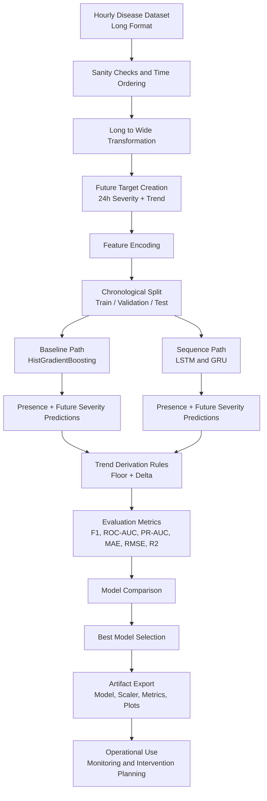

# Tomato Disease Progression Model

> **Who is this for?**
> This document is written for anyone - grower, student, analyst, developer, or stakeholder - with zero prior machine learning knowledge. It explains the full notebook in plain language first, then adds deeper technical details with direct mapping to notebook variables and outputs.

---

## Table of Contents

1. [Why Does This Matter?](#1-why-does-this-matter)
2. [What Does This Model Actually Predict?](#2-what-does-this-model-actually-predict)
3. [Which Diseases Are Included?](#3-which-diseases-are-included)
4. [The Dataset - What Data Goes In?](#4-the-dataset---what-data-goes-in)
5. [How Does the Notebook Work? - A Plain-English Walkthrough](#5-how-does-the-notebook-work---a-plain-english-walkthrough)
   - [Section 0 - Run ID and Path Setup](#section-0---run-id-and-path-setup)
   - [Section 1 - Setup and Imports](#section-1---setup-and-imports)
   - [Section 2 - Load Hourly Dataset](#section-2---load-hourly-dataset)
   - [Section 3 - Sanity Checks](#section-3---sanity-checks)
   - [Section 4 - Long to Wide Transformation](#section-4---long-to-wide-transformation)
   - [Section 5 - Future Target Construction](#section-5---future-target-construction)
   - [Section 6 - Feature Encoding Pipeline](#section-6---feature-encoding-pipeline)
   - [Section 7 - Encoded Feature Integrity Check](#section-7---encoded-feature-integrity-check)
   - [Section 8 - Time-Based Train/Val/Test Split](#section-8---time-based-trainvaltest-split)
   - [Section 9 - Baseline Lag Feature Matrix](#section-9---baseline-lag-feature-matrix)
   - [Section 10 - Baseline Presence Model](#section-10---baseline-presence-model)
   - [Section 11 - Baseline Future Severity Model](#section-11---baseline-future-severity-model)
   - [Section 12 - Baseline Trend Derivation](#section-12---baseline-trend-derivation)
   - [Section 13 - Evaluation Utilities](#section-13---evaluation-utilities)
   - [Sections 14 and 15 - Baseline Validation/Test Performance](#sections-14-and-15---baseline-validationtest-performance)
   - [Section 16 - Sequence Window Construction](#section-16---sequence-window-construction)
   - [Section 17 - Sequence Feature Scaling](#section-17---sequence-feature-scaling)
   - [Section 18 - LSTM/GRU Model Builder](#section-18---lstmgru-model-builder)
   - [Section 19 - Train LSTM](#section-19---train-lstm)
   - [Section 20 - Train GRU and Select Global Best](#section-20---train-gru-and-select-global-best)
   - [Section 21 - Training Curves](#section-21---training-curves)
   - [Section 22 - Evaluate Deep Models](#section-22---evaluate-deep-models)
   - [Section 23 - Additional Diagnostic Plots](#section-23---additional-diagnostic-plots)
   - [Section 24 - Model Comparison Table](#section-24---model-comparison-table)
   - [Section 25 - Real-Time Inference Demo](#section-25---real-time-inference-demo)
   - [Section 26 - Artifact Export](#section-26---artifact-export)
   - [Section 27 - Practical Scenario Simulation](#section-27---practical-scenario-simulation)
6. [How the Models Work Under the Hood](#6-how-the-models-work-under-the-hood)
7. [Trend Logic and Severity Floor](#7-trend-logic-and-severity-floor)
8. [How We Measure Success](#8-how-we-measure-success)
9. [Why Future R2 Was Negative and How It Was Improved](#9-why-future-r2-was-negative-and-how-it-was-improved)
10. [All Output Files - What Gets Saved and Where](#10-all-output-files---what-gets-saved-and-where)
11. [Running the Notebook](#11-running-the-notebook)
12. [End-to-End Flow Diagram](#12-end-to-end-flow-diagram)
13. [Common Questions (FAQ)](#13-common-questions-faq)
14. [Glossary](#14-glossary)
15. [Recommended Learning Path](#15-recommended-learning-path)
16. [Concept Dependency Map](#16-concept-dependency-map)
17. [How to Read One Prediction Row](#17-how-to-read-one-prediction-row)
18. [Self-Check Exercises](#18-self-check-exercises)
19. [Visual Concept Diagram (Mermaid)](#19-visual-concept-diagram-mermaid)
20. [Standalone Test Suite: `test_disease_progression.py`](#20-standalone-test-suite-testdiseaseprogressionpy)
21. [Quick Concept Snapshot (Text Diagram)](#21-quick-concept-snapshot-text-diagram)

---

## 1. Why Does This Matter?

Disease progression in greenhouse tomatoes is not random. Environmental conditions like humidity, leaf wetness, airflow, temperature, and crop stage influence how quickly diseases appear and spread.

The operational challenge is timing:

- If intervention is too late, infection can expand rapidly.
- If intervention is too early or unnecessary, costs increase and resources are wasted.

This notebook turns raw hourly greenhouse data into actionable foresight:

1. Is each disease present now?
2. How severe is it likely to be in 24 hours?
3. Is each disease absent, emerging, reducing, stable, or worsening?

So instead of reacting after visible damage, teams can make proactive control decisions.

---

## 2. What Does This Model Actually Predict?

For every timestamp window, the pipeline produces disease-wise predictions.

| Output | Type | Plain-English Meaning |
|--------|------|-----------------------|
| Presence flags | Multi-label classification | "Is disease X active right now?" (yes/no per disease) |
| Future severity (24h) | Multi-output regression | "What infection percentage will disease X have in 24 hours?" |
| Future trend (24h) | Rule-derived class | "Will disease X be absent, emerging, reducing, stable, or worsening?" |

Important: trend is derived from current severity and predicted future severity, not trained as a separate neural-network softmax output.

---

## 3. Which Diseases Are Included?

The notebook works over the disease set found in the synthetic disease progression dataset (for example classes such as early blight, late blight, leaf mold, septoria leaf spot, and spider mites).

At runtime, diseases are discovered directly from the dataset and encoded into disease-specific column groups:

- `PRES_COLS` for current presence columns
- `SEV_COLS` for current severity columns
- `future_severity_24h__*` for 24-hour future targets
- `trend_24h__*` for trend labels

This dynamic approach means the pipeline can adapt if the disease list changes, as long as source columns remain consistent.

---

## 4. The Dataset - What Data Goes In?

**Primary dataset path:**
`data/processed/Disease Progression/tomato_disease_progression_synthetic_hourly.csv`

The source is hourly synthetic but physically plausible greenhouse data in long format.

### Long format (input idea)

One timestamp has multiple rows, one per disease.

Example rows:

- `2025-01-01 10:00, disease=early_blight, current_infection_pct=3.1`
- `2025-01-01 10:00, disease=late_blight, current_infection_pct=0.0`

### Wide format (model-ready idea)

After pivot, one timestamp becomes one row with disease-specific columns.

Example shape concept:

- `current_infection_pct__early_blight=3.1`
- `current_infection_pct__late_blight=0.0`
- `disease_present__early_blight=1`
- `disease_present__late_blight=0`

Why this transformation matters: machine learning models require fixed-size feature vectors per sample.

---

## 5. How Does the Notebook Work? - A Plain-English Walkthrough

The notebook has Sections 0 to 27. Each section has a clear purpose.

---

### Section 0 - Run ID and Path Setup

**What it does:**

- Detects project root
- Creates or reuses `RUN_ID`
- Sets dataset path, model path, artifacts path, and log path
- Stores constants in `CONFIG`

**Key configuration values:**

- `history_window = 24`
- `forecast_horizon = 24`
- `severity_delta = 3.0`
- `severity_floor = 0.5`
- `presence_threshold = 0.5`

**Why it matters:** reproducibility and clean experiment tracking without artifact overwrites.

---

### Section 1 - Setup and Imports

**What it does:**

- Imports core libraries (`pandas`, `numpy`, `scikit-learn`, `tensorflow`, plotting)
- Sets random seed
- Configures plotting defaults

**Why it matters:** makes runs reproducible and comparable.

---

### Section 2 - Load Hourly Dataset

**What it does:**

- Reads CSV
- Parses timestamps
- Sorts chronologically

**Why it matters:** sequence learning depends on correct time order.

---

### Section 3 - Sanity Checks

**What it does:**

- Prints unique diseases and stages
- Checks date range
- Verifies rows per timestamp

**Why it matters:** catches malformed data before expensive training.

---

### Section 4 - Long to Wide Transformation

**What it does:**

- Pivots disease rows to disease-wise columns
- Fills missing values where appropriate
- Constructs `PRES_COLS`, `SEV_COLS`, and disease list metadata

**Why it matters:** creates stable tabular structure for baseline and sequence paths.

---

### Section 5 - Future Target Construction

**What it does:**

- Builds 24-hour future severity targets with shift operations
- Computes trend labels using `compute_trend(...)`
- Uses `severity_floor` to avoid low-value rounding confusion
- Drops rows where future target is unavailable

**Why it matters:** this is where supervised labels are created.

Rule behavior example with `delta=3.0`, `floor=0.5`:

- `current=0.2`, `future=0.1` -> `absent`
- `current=0.0`, `future=2.0` -> `emerging`
- `current=15`, `future=10` -> `reducing`
- `current=12`, `future=13` -> `stable`
- `current=8`, `future=14` -> `worsening`

---

### Section 6 - Feature Encoding Pipeline

**What it does:**

- Detects categorical columns
- One-hot encodes them
- Excludes target columns from model feature set

**Why it matters:** prevents leakage and ensures all model inputs are numeric.

---

### Section 7 - Encoded Feature Integrity Check

**What it does:**

- Confirms no object/text dtypes remain in encoded feature matrix

**Why it matters:** avoids runtime fitting errors.

---

### Section 8 - Time-Based Train/Val/Test Split

**What it does:**

- Chronological split: 70% train, 15% validation, 15% test

**Why it matters:** simulates real forecasting where future cannot influence past training.

---

### Section 9 - Baseline Lag Feature Matrix

**What it does:**

- Converts the previous 24 hours into lagged flat features
- Aligns baseline labels for presence, future severity, and trend

**Why it matters:** provides fair temporal context for tabular baselines.

---

### Section 10 - Baseline Presence Model

**What it does:**

- Trains multi-output gradient boosting classifier for disease presence

**Why it matters:** strong non-deep benchmark for multi-label classification.

---

### Section 11 - Baseline Future Severity Model

**What it does:**

- Trains multi-output gradient boosting regressor for future severity
- Clips predictions to 0-100

**Why it matters:** stable baseline for regression and physically valid outputs.

---

### Section 12 - Baseline Trend Derivation

**What it does:**

- Converts baseline future severity predictions into trend classes via rules

**Why it matters:** keeps trend interpretation consistent with severity behavior.

---

### Section 13 - Evaluation Utilities

**What it does:**

- Defines reusable reports for:
  - presence metrics
  - future severity regression metrics
  - trend classification metrics

**Why it matters:** standardized evaluation across all model families.

---

### Sections 14 and 15 - Baseline Validation/Test Performance

**What they do:** run full baseline metrics on validation and test splits.

**Why they matter:** baseline context is required to interpret deep model gains.

---

### Section 16 - Sequence Window Construction

**What it does:**

- Creates 3D tensors for recurrent models
- Typical shape: `samples x time_steps x features`
- Aligns sequence labels to the end timestamp of each window

**Why it matters:** LSTM/GRU need sequence-shaped inputs.

---

### Section 17 - Sequence Feature Scaling

**What it does:**

- Fits scaler on training sequence features only
- Applies transform to validation and test

**Why it matters:** stable optimization with no validation/test leakage.

---

### Section 18 - LSTM/GRU Model Builder

**What it does:**

- Builds two-head recurrent architecture:
  - `presence_head` for multi-label disease presence
  - `future_head` for future severity regression

**Why it matters:** one shared temporal encoder supports both tasks.

---

### Section 19 - Train LSTM

**What it does:**

- Trains LSTM with callbacks (early stopping, LR schedule, checkpoint)

**Why it matters:** captures best validation epoch and reduces overfitting.

---

### Section 20 - Train GRU and Select Global Best

**What it does:**

- Trains GRU similarly
- Compares validation losses
- Sets global best checkpoint path

**Why it matters:** automatic, reproducible model-family selection.

---

### Section 21 - Training Curves

**What it does:**

- Saves plots for:
  - total loss
  - presence-head loss
  - future-head loss
  - presence binary accuracy

**Why it matters:** fast visual diagnostics for convergence and overfitting.

---

### Section 22 - Evaluate Deep Models

**What it does:**

- Loads best LSTM and GRU checkpoints
- Computes detailed test metrics
- Keeps final best model summary

**Important enhancement included:**

- Validation-tuned blending for LSTM future outputs with baseline future outputs
- Improves future regression quality (R2) without retraining LSTM
- Keeps checkpoint and training-loss trajectory unchanged

Blend interpretation:

- `alpha = 1.0` -> pure LSTM future prediction
- `alpha = 0.0` -> pure baseline future prediction
- `0 < alpha < 1` -> weighted hybrid

---

### Section 23 - Additional Diagnostic Plots

**What it does:**

- ROC and PR curves for presence
- Residual histograms for future severity
- Parity plots for predicted vs actual future severity

**Why it matters:** reveals calibration, spread, and regression bias patterns.

---

### Section 24 - Model Comparison Table

**What it does:**

- Compiles baseline, LSTM, and GRU metrics into a single comparison table

**Why it matters:** stakeholder-friendly decision summary.

---

### Section 25 - Real-Time Inference Demo

**What it does:**

- Runs prediction on latest available window
- Prints per-disease current and 24h forecast outputs

**Why it matters:** mirrors deployment-style inference workflow.

---

### Section 26 - Artifact Export

**What it does:**

- Exports model comparison, metrics, config, best checkpoints, scaler, and selected model

**Why it matters:** reproducibility and production handoff.

---

### Section 27 - Practical Scenario Simulation

**What it does:**

- Applies realistic stress changes (humidity, airflow, VPD, etc.)
- Compares before/after disease predictions
- Prints trend coverage and representative examples

**Why it matters:** converts model output into practical agronomy narratives.

---

## 6. How the Models Work Under the Hood

### 6.1 Baseline models (HistGradientBoosting)

Presence baseline pattern:

```python
presence_baseline = MultiOutputClassifier(
    HistGradientBoostingClassifier(
        learning_rate=0.05,
        max_depth=6,
        max_iter=200,
        random_state=SEED,
    )
)
```

Future severity baseline pattern:

```python
future_sev_baseline = MultiOutputRegressor(
    HistGradientBoostingRegressor(
        learning_rate=0.05,
        max_depth=6,
        max_iter=250,
        random_state=SEED,
    )
)
```

Interpretation:

- One model is trained per disease output.
- Trees learn non-linear interactions from tabular lag features.
- Regression outputs are clipped to `[0, 100]` for physical realism.

### 6.2 Sequence models (LSTM and GRU)

Sequence models process the past 24 hourly steps and learn temporal dependencies.

Intuition:

- LSTM stores and updates memory with gating.
- GRU provides a similar but lighter recurrent mechanism.
- Both share temporal encoder layers and then branch into task-specific heads.

Two-head concept:

- `presence_head`: sigmoid probabilities for disease presence
- `future_head`: regression-style output for next-24h severity

### 6.3 Losses and optimizer

Compile logic in the notebook uses:

```python
loss = {
    "presence_head": "binary_crossentropy",
    "future_head": "mse",
}
```

Meaning:

- Binary crossentropy trains calibrated probabilities for presence.
- Mean squared error penalizes larger future-severity misses.
- Adam optimizer adapts per-parameter learning rates for stable convergence.

### 6.4 Callbacks and training safety

The training uses callbacks such as:

- EarlyStopping
- ReduceLROnPlateau
- ModelCheckpoint

These improve stability and ensure best checkpoints (`best_lstm_*.keras`, `best_gru_*.keras`) are preserved.

---

## 7. Trend Logic and Severity Floor

Trend is derived from `(current_severity, predicted_future_severity)` and rule thresholds.

Main controls:

- `severity_delta = 3.0`
- `severity_floor = 0.5`

Why floor is critical:

- Tiny future values can round to `0.0` in display.
- Without floor handling, low-noise predictions can be mislabeled as `emerging`.

With floor-aware logic:

- both near-zero -> `absent`
- now near-zero, future meaningful -> `emerging`
- future much lower -> `reducing`
- small change -> `stable`
- future much higher -> `worsening`

Example decisions:

1. `current=0.00, future=0.20` -> `absent`
2. `current=0.00, future=1.80` -> `emerging`
3. `current=22.0, future=17.0` -> `reducing`
4. `current=10.0, future=11.0` -> `stable`
5. `current=7.0, future=13.0` -> `worsening`

---

## 8. How We Measure Success

### Presence metrics (multi-label)

- Micro-F1: overall detection quality across all disease flags
- Macro-F1: average per-disease quality
- ROC-AUC: ranking quality across thresholds
- PR-AUC: useful when positives are sparse
- Brier score: probability calibration quality (lower is better)

### Future severity metrics (regression)

- MAE: average absolute error in percentage points
- RMSE: larger misses are penalized more strongly
- R2:
  - `1.0` perfect
  - `0.0` equal to mean predictor
  - `< 0.0` worse than mean predictor
- EVS: explained variance score
- MedAE: median absolute error (robust summary)

### Trend metric

- Trend Macro-F1: average F1 across trend classes

---

## 9. Why Future R2 Was Negative and How It Was Improved

If future R2 is negative, future-severity predictions are noisier than a simple average baseline.

The notebook now includes validation-tuned blending during evaluation:

$$
\hat{y}_{blend} = \alpha\hat{y}_{LSTM} + (1-\alpha)\hat{y}_{baseline}
$$

Workflow:

1. Generate LSTM future predictions.
2. Align baseline future predictions by sequence timestamp.
3. Search `alpha` on validation set for best mean R2.
4. Apply best alpha on test evaluation.

Key point: no LSTM retraining is required, so checkpoint behavior and training loss dynamics remain unchanged.

---

## 10. All Output Files - What Gets Saved and Where

Artifacts are saved under:

`src/agritwin_gh/models/artifacts/disease_progression_<RUN_ID>/`

### Core files in artifact folder

| File | What it contains |
|------|------------------|
| `baseline_presence_hgb.joblib` | Baseline presence model |
| `baseline_future_severity_hgb.joblib` | Baseline future-severity model |
| `best_lstm_<RUN_ID>.keras` | Best LSTM checkpoint |
| `best_gru_<RUN_ID>.keras` | Best GRU checkpoint |
| `lstm_disease_progression_best.keras` | Exported best LSTM model |
| `gru_disease_progression_best.keras` | Exported best GRU model |
| `sequence_feature_scaler.joblib` | Sequence feature scaler |
| `deep_model_metrics.json` | Detailed deep-model metrics |
| `model_comparison.csv` | Baseline/LSTM/GRU summary comparison |
| `config.json` | Run configuration snapshot |
| `run_<RUN_ID>.log` | Run log |

### Plots commonly exported

| File | What it shows |
|------|---------------|
| `lstm_training_curves.png` | LSTM training metrics over epochs |
| `gru_training_curves.png` | GRU training metrics over epochs |
| `lstm_roc_pr_curves.png` | Presence ROC/PR diagnostics |
| `lstm_future_residual_histograms.png` | Future-severity residual distribution |
| `lstm_future_parity_plots.png` | Predicted vs actual future severity |

### Primary saved model path

`src/agritwin_gh/models/disease_progression_<RUN_ID>.keras`

---

## 11. Running the Notebook

### Prerequisites

From the project root:

```powershell
.venv\Scripts\Activate.ps1
pip install -r requirements.txt
```

### Steps

1. Open `notebooks/tomato_disease_progression.ipynb`.
2. Select the project Python environment (`.venv`) as kernel.
3. Run all cells in order from Section 0 to Section 27.
4. Check printed model selection and artifact summary.
5. Review outputs in the run artifact folder.

---

## 12. End-to-End Flow Diagram

```text
Hourly disease CSV (long format)
    |
    v
[Section 2] Load + sort + parse timestamps
    |
    v
[Section 3] Sanity checks
    |
    v
[Section 4] Pivot long -> wide disease matrix
    |
    v
[Section 5] Create 24h future targets + trend labels
    |
    v
[Section 6-7] Encode and validate feature matrix
    |
    v
[Section 8] Chronological split (train/val/test)
    |
    +--> [Sections 9-15] Baseline models + baseline evaluation
    |
    +--> [Sections 16-22] Sequence tensors + LSTM/GRU train/eval
    |
    v
[Section 23] Deep diagnostics plots
    |
    v
[Section 24] Model comparison summary
    |
    v
[Section 25] Real-time inference demo
    |
    v
[Section 26] Export models, scaler, metrics, config
    |
    v
[Section 27] Scenario simulation for practical interpretation
```

---

## 13. Common Questions (FAQ)

**Q: Why are there two model families (baseline and deep)?**
A: Baselines provide a strong reference. Deep models must beat or complement them to justify complexity.

**Q: Why is the split chronological instead of random?**
A: Random split leaks future patterns into training. Chronological split is the realistic forecasting setup.

**Q: Why can trend still show "emerging" when values look near zero?**
A: Display rounding can hide small non-zero values. The `severity_floor` is used to prevent misleading low-noise transitions.

**Q: Is the R2 improvement a retraining trick?**
A: No. It is an evaluation-time calibrated blend of future predictions, selected on validation data.

**Q: Which model should be deployed?**
A: The notebook logs and exports the selected global best checkpoint and supporting config/metrics.

**Q: Can this run on CPU only?**
A: Yes. Training is slower but still valid.

---

## 14. Glossary

| Term | Plain-English Definition |
|------|--------------------------|
| Baseline model | A simpler model used for comparison against complex models |
| Brier score | A metric for probability calibration; lower is better |
| Chronological split | Train/validation/test split by time order |
| Deep learning | Neural-network-based machine learning |
| Feature | Input variable used by model |
| Forecast horizon | How far ahead prediction is made (24h here) |
| GRU | Gated Recurrent Unit, a recurrent sequence model |
| HistGradientBoosting | Tree ensemble method used for strong tabular baselines |
| LSTM | Long Short-Term Memory recurrent model |
| MAE | Mean absolute error |
| Multi-label classification | Predicting multiple yes/no labels simultaneously |
| Multi-output regression | Predicting multiple numeric outputs simultaneously |
| PR-AUC | Precision-recall area under curve |
| ROC-AUC | Receiver operating characteristic area under curve |
| R2 | Coefficient of determination for regression goodness |
| Severity delta | Minimum change required to call trend reducing/worsening |
| Severity floor | Value below which severity is treated as effectively zero for trend logic |
| Time window | Fixed history length used for sequence inputs |
| Trend class | Derived label: absent, emerging, reducing, stable, worsening |

---

## 15. Recommended Learning Path

If you are learning this topic for the first time, follow this order.

### Track A: Non-technical reader (farmer, manager, operations)

1. Read Sections 1, 2, and 4 to understand the problem and inputs.
2. Read Section 5 only for Section 0 to Section 5 summaries.
3. Read Sections 7, 8, and 9 to understand trend meaning and R2 behavior.
4. Read Section 12 flow diagram and Section 13 FAQ.

Outcome: you can interpret predictions and make action decisions confidently.

### Track B: Beginner ML learner

1. Complete Track A.
2. Study Section 5 completely (Sections 0 to 27).
3. Study Section 6 (model internals) and Section 8 (metrics).
4. Use Section 17 and Section 18 exercises for practice.

Outcome: you can explain how the notebook works end to end and why each metric matters.

### Track C: Developer and maintainer

1. Complete Track B.
2. Focus on Section 10 (artifacts) and Section 11 (run process).
3. Review Section 9 (R2 improvement logic) before changing evaluation behavior.
4. Validate modifications using the checklist in Section 17.

Outcome: you can safely modify, rerun, and ship the pipeline.

---

## 16. Concept Dependency Map

Use this map when you are confused about where to look next.

1. If you do not understand trend labels:
Read Section 7 first, then Section 5 (Section 5 target construction), then Section 17.

2. If you do not understand why R2 changed:
Read Section 8 (R2 meaning), then Section 9 (blend logic), then Section 22 notes inside Section 5.

3. If model outputs feel contradictory:
Check Section 17 checklist, then Section 13 FAQ, then exported plots in Section 10.

4. If training and inference behavior feel different:
Read Section 6.4 callbacks, Section 9 blend workflow, and Section 26 export notes in Section 5.

5. If you are unsure what to trust for reporting:
Use Section 8 metrics definitions and Section 10 artifact files as the source of truth.

---

## 17. How to Read One Prediction Row

Use this 6-step checklist every time you read an inference output row.

1. Identify the disease and timestamp.
2. Check current presence and current severity first.
3. Check predicted 24h severity and compute mental change: future minus current.
4. Compare that change to `severity_delta` and `severity_floor` rules.
5. Verify that the printed trend class matches the rule-based expectation.
6. Decide intervention urgency:
Low urgency if absent/stable with low severity; high urgency if emerging/worsening with meaningful severity.

Mini example:

- Current severity: 1.2
- Predicted 24h severity: 6.4
- Change: +5.2
- With delta 3.0, trend should be worsening

Interpretation: risk is rising and action should be planned before the next 24-hour cycle.

Validation checklist before sharing outputs:

1. Confirm run ID and artifact folder match this run.
2. Confirm the same split policy was used (chronological split).
3. Confirm trend logic still uses the current floor and delta values.
4. Confirm metrics and plots are from the same exported run.

---

## 18. Self-Check Exercises

Try these quickly after reading the guide.

### Exercise 1: Trend rule practice

Given `severity_floor=0.5` and `severity_delta=3.0`, classify each case:

1. current=0.1, future=0.2
2. current=0.0, future=1.3
3. current=11.0, future=7.0
4. current=9.0, future=10.5
5. current=6.0, future=10.2

Expected labels:

1. absent
2. emerging
3. reducing
4. stable
5. worsening

### Exercise 2: Metric interpretation

Which statement is correct?

1. R2 below 0 always means training failed.
2. R2 below 0 means this regression is worse than predicting the mean baseline.
3. R2 above 0.5 guarantees perfect trend classes.

Correct answer: 2.

### Exercise 3: Operational interpretation

If a disease is currently low but predicted to rise above delta in 24h, what should happen operationally?

Suggested answer: mark as proactive intervention candidate and monitor associated climate factors (humidity, wetness, airflow) before the next cycle.

---

## 19. Visual Concept Diagram (Mermaid)

This diagram shows how information flows from raw data to decisions.



How to use this diagram:

1. Follow top to bottom once for the complete pipeline.
2. Revisit only the branch you need (baseline or sequence).
3. If prediction interpretation is confusing, jump to "Trend Derivation Rules" and then back to Section 7.

---

## 20. Standalone Test Suite: `test_disease_progression.py`

### 20.1 Overview

**File location:** `scripts/test_disease_progression.py`

**Purpose:**  
Standalone test script to validate the trained Disease Progression model (LSTM/GRU) across 10 diverse scenarios covering disease absence, outbreak conditions, environmental stress, treatment effects, and trend verification.

**Why it exists:**  
The model predicts disease presence (yes/no per disease), future severity (24h ahead, per disease), and trend labels (absent/emerging/reducing/stable/worsening). This script exercises the model with synthetic disease scenarios without requiring the training notebook or live sensor data — enabling rapid validation and confidence checks.

### 20.2 Usage

```bash
# Run all 10 scenarios
python scripts/test_disease_progression.py

# Run a specific scenario (1–10)
python scripts/test_disease_progression.py --scenario 3
```

### 20.3 What the Script Tests

| # | Scenario | What it validates |
|---|----------|-------------------|
| 1 | **Healthy greenhouse** – optimal conditions | Model correctly predicts all diseases absent; presence flags = 0 |
| 2 | **High humidity / poor ventilation** – Leaf Mold risk | Model identifies emerging Leaf Mold; other diseases remain absent |
| 3 | **Hot dry stress** – Spider Mites + Powdery Mildew risk | Model detects multiple disease risks under stress conditions |
| 4 | **Seedling stage** – moderate conditions baseline | Model calibrated for early growth stage; low disease pressure |
| 5 | **Ripe stage** – damp late-season conditions | Model identifies late-season disease risk (Late Blight in humid conditions) |
| 6 | **Worsening** – Early Blight severity ramps 5→40% | Model predicts worsening trend; future severity should increase |
| 7 | **Recovery** – Leaf Mold drops 45→5% with treatment | Treatment control flag active; model predicts reducing trend |
| 8 | **All diseases at 60% severity** – multi-disease outbreak | Model handles simultaneous multi-disease simulation; validates independence |
| 9 | **Nocturnal damp spell** – night humidity peak | Day/night cycle test; night conditions favour fungal diseases |
| 10 | **Post-treatment** – Spider Mites 30% + treatment active | Validates model response to control action flags |

### 20.4 Expected Output Structure

For each scenario, the script prints a table:

```
──────────────────────────────────────────────────────────────────────
Scenario  6: Worsening — Early Blight severity ramps 5→40%
  Disease              Presence  Current %  Future 24h %  Trend
  ──────────────────────────────────────────────────────────────────
  early_blight             1.0        5.0         15.3  worsening
  late_blight              0.0        0.0          0.0  absent
  leaf_mold                0.0        0.0          0.0  absent
  powdery_mildew           0.0        0.0          0.0  absent
  spider_mites             0.0        0.0          0.0  absent
```

**Columns:**
- `Presence` – (0 or 1) Is disease currently active? (binary classification output)
- `Current %` – Current severity/infection percentage (0–100)
- `Future 24h %` – Model-predicted 24-hour-ahead severity
- `Trend` – Derived label: absent | emerging | reducing | stable | worsening

**Trend derivation rules** (from Section 7 of main notebook):
- `absent` — current % < floor (0.5%) AND future < floor
- `emerging` — current < floor AND future ≥ floor + delta (3.0)
- `reducing` — current > future + delta
- `worsening` — current < future – delta
- `stable` — all else (neither reducing nor worsening significantly)

### 20.5 Feature Input Strategy

Each scenario constructs a 24-timestep sequence (HISTORY_WINDOW) where:
- **All timesteps** have **identical feature values** (static snapshot model)
- Environmental features (temp, humidity, air velocity, leaf wetness) are set per scenario
- Stage one-hot encoding reflects the growth stage (seedling, vegetative, flowering, etc.)
- Disease severity (0–100) and presence flags (0 or 1) are set per scenario
- Control action flags (treatment indicators) are activated for treatment scenarios

**Key features set per scenario (92 total):**

- `indoor_temp`, `indoor_humidity`, `air_velocity` (feats 10–12) – environment
- `leaf_wetness_proxy`, `vpd` (feats 18, 16) – moisture and stress indicators
- `stage_name_*` (feats 56–61) – one-hot encoded growth stage
- `control_action_flag__*` (feats 26, 31, 36, 41, 46) – treatment active? (per disease)
- `current_infection_pct__*` (feats 82–86) – current severity per disease
- `disease_present_flag__*` (feats 87–91) – presence indicator per disease

### 20.6 Troubleshooting Failed Scenarios

**All trends show "absent":**
- Check that severity values are above the floor threshold (0.5%); increase current % in scenario if needed
- Verify the scaler is loaded correctly

**Unexpected future severity (e.g., increases despite treatment):**
- Confirm `control_action_flag` is set to 1.0 for the treated disease
- Check that `current_infection_pct` is above zero (model may not predict recovery from zero)

**Import errors:**
- Confirm virtual environment is activated and dependencies installed
- Verify model checkpoint file exists at the path shown during load phase

**"Feature count mismatch" errors:**
- Ensure exactly 92 features are present after one-hot encoding of stages
- Check that all disease and stage columns are correctly set in `_set_disease()` and `_set_stage()`

### 20.7 Integration with AgriTwin-GH

This script provides a **standalone diagnostic interface** to the Disease Progression model:

1. **Model validation** – After training, verify predictions are sensible across disease/stage/environment combinations
2. **What-if analysis** – Ask "What if humidity rises to 90%?" without running a full simulation
3. **Feature engineering debugging** – Confirm feature fill logic produces expected model responses
4. **Documentation** – Provides working examples of sequence construction for inference

For greenhouse deployment, live sensor data flows through `src/agritwin_gh/models/disease_inference.py` → REST API → greenhouse control logic.

## 21. Quick Concept Snapshot (Text Diagram)

Use this when Mermaid rendering is not available.

```text
Raw hourly disease logs
    -> quality checks
    -> long-to-wide pivot
    -> 24h future labels + trend labels
    -> feature encoding
    -> time-based split
    -> [baseline models] and [LSTM/GRU models]
    -> predictions (presence + 24h severity)
    -> trend rules (floor + delta)
    -> metrics + comparison
    -> best model + artifact export
    -> greenhouse action planning
```

Memory anchor for beginners:

"Observe -> Prepare -> Predict -> Explain -> Decide"

- Observe: load and check data.
- Prepare: reshape and create targets.
- Predict: run baseline and deep models.
- Explain: derive trend and evaluate metrics.
- Decide: select/export best model and act operationally.

